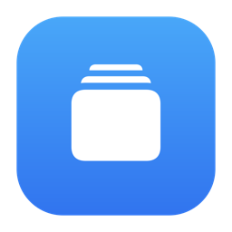

<div align="center">
  
  <h1>StillMotion</h1>
  <p><strong>Native, per-display video wallpapers for macOS.</strong></p>
  <p>Turn local videos into quiet, continuously looping desktop backgrounds that automatically pause when they should.</p>
</div>

StillMotion is a macOS 14+ menu-bar utility that plays a local video behind Finder desktop icons. Each display can have its own background, and playback automatically freezes at the current frame when a full-screen application occupies that display. Unaffected displays keep playing.

The app uses native AppKit, SwiftUI, AVFoundation, and Core Graphics APIs. It has no accounts, telemetry, advertising, cloud service, or background network dependency.

## Features

- **Independent backgrounds per display:** assign a different video to every connected monitor.
- **Per-display full-screen pausing:** only the display containing a full-screen app pauses; other displays continue playing.
- **Manual playback control:** pause or resume all backgrounds from the menu-bar context menu.
- **System-aware playback:** automatically pauses during system sleep, display sleep, and inactive login sessions.
- **Seamless looping:** videos loop continuously with audio muted.
- **Desktop integration:** wallpaper windows stay behind Finder icons, follow every Space, and ignore mouse input.
- **System transition fallback:** a representative video frame is synchronized with the macOS desktop image for Mission Control, Show Desktop, and Space transitions.
- **Persistent assignments:** selected backgrounds and manual pause state are restored when StillMotion launches again.
- **Display reconnection:** assignments are retained when a display disconnects and restored when the same display returns.
- **Managed media:** imported videos are copied into StillMotion's Application Support directory, so moving or deleting the original does not break playback.
- **Still previews:** the menu shows a cached preview and original filename for each assigned background.
- **Finder integration:** reveal an assigned background in Finder or remove it from the right-click menu.
- **Native and universal:** release builds support both Apple Silicon and Intel Macs.

## Requirements

- macOS 14 Sonoma or later
- Apple Silicon or Intel Mac
- A local video supported by AVFoundation

## Install

### Homebrew

Install StillMotion from its Homebrew tap:

```sh
brew install --cask pergioa/tap/stillmotion
```

Upgrade later releases with:

```sh
brew upgrade --cask pergioa/tap/stillmotion
```

### Disk Image

1. Download the latest `StillMotion-<version>.dmg` from [GitHub Releases](https://github.com/pergioa/StillMotion/releases).
2. Open the disk image.
3. Drag `StillMotion.app` onto the included Applications shortcut.
4. Open StillMotion from the Applications folder.

Current releases are unsigned and not notarized. On first launch, macOS may block the app because it cannot verify the developer. Right-click `StillMotion.app`, choose **Open**, and confirm. You only need to do this once for that installation.

## Use

1. Open StillMotion and select its icon in the menu bar.
2. Select one of the connected displays.
3. Choose **Choose Background** and select a supported video.
4. Repeat for any additional displays.

Use `Command-O` while the popover is open to choose a background for the selected display.

Right-click the menu-bar icon for additional controls:

- Play or pause all backgrounds
- Reveal the selected display's background in Finder
- Remove the selected display's background
- Quit StillMotion

## Media Support

| Property | Support |
| --- | --- |
| File extensions | MP4, MOV, and M4V, case-insensitive |
| Maximum size | 1 GiB per imported file |
| Video codecs | Any codec playable by AVFoundation on the current Mac |
| Audio | Always muted |
| Scaling | Aspect fill; edges may be cropped to cover the display |
| Resolution and duration | No explicit limit beyond playability and file size |

StillMotion validates that an import is a regular, playable file containing a video track. The original file is opened read-only and copied into the app's managed storage.

## Playback Behavior

StillMotion applies playback restrictions in this order:

| State | Result |
| --- | --- |
| Manually paused | Every background freezes at its current frame |
| System or displays sleeping | Every background pauses |
| Login session inactive | Every background pauses |
| Full-screen app visible | Only backgrounds on affected displays pause |
| No restriction | Assigned backgrounds play and loop |

Manual pause intent is preserved across full-screen and system transitions. For example, a background will not resume after a full-screen app closes if it was already paused manually.

## How It Works

- `AppModel` owns persisted assignments, display state, user intent, and playback policy.
- `MediaImportService` validates selected files, creates managed copies, and generates representative still frames.
- `WallpaperCoordinator` maintains one wallpaper window and one muted `AVQueuePlayer`/`AVPlayerLooper` per active display assignment.
- `WallpaperWindow` creates a noninteractive, borderless desktop-level window that follows all Spaces.
- `FullScreenDetector` classifies visible, display-sized windows using public Core Graphics APIs.
- `SystemActivityObserver` tracks sleep, display sleep, and login-session activity.
- `PlaybackPolicy` combines manual, system, media, and per-display full-screen state into the effective playback decision.

## Privacy And Permissions

StillMotion is sandboxed and uses the user-selected, read-only file entitlement.

- Selected videos are accessed only during import and copied into the app's managed storage.
- Original videos are not modified.
- Full-screen detection reads metadata for currently visible windows through the public Core Graphics window-list API; it does not capture screen contents.
- No Screen Recording or Accessibility permission is requested.
- No analytics, telemetry, account system, or updater is included.
- The Buy Me a Coffee button only opens an external page in the default browser.

## Resource Behavior

- StillMotion creates one native AVFoundation player for each connected display with an assigned background.
- Players are paused and released when assignments are removed or displays disconnect.
- Full-screen polling runs only while it is needed and uses a one-second interval with timer tolerance.
- Generated still frames are cached and reused.
- Preview images are decoded at utility priority and stored in a size-limited in-memory cache.
- Videos are copied during import, so managed storage can use approximately the same disk space as each selected source file.

## Limitations

macOS does not expose a public API for enumerating windows in inactive Spaces. StillMotion detects full-screen apps in currently visible Spaces. A full-screen app in a hidden Space is detected after that Space becomes visible.

macOS also does not include third-party desktop windows in every system-owned transition. StillMotion synchronizes a representative still frame as the system wallpaper to reduce visual discontinuity, but the background may appear frozen during Mission Control, Show Desktop, and Space animations.

StillMotion intentionally avoids private CGS and Spaces APIs. It currently does not include launch-at-login behavior or an automatic updater, and it does not explicitly restore the system wallpaper that existed before a background was assigned.

## Development

Open `StillMotion.xcodeproj`, select the `StillMotion` scheme, and run.

Build and run the complete test suite with Xcode:

```sh
xcodebuild -project StillMotion.xcodeproj -scheme StillMotion -destination 'platform=macOS' build test
```

Run the portable core-logic checks with the Swift command-line toolchain:

```sh
swift run StillMotionLogicChecks
```

## Release Builds

Create the unsigned DMG installer:

```sh
make release-dmg
```

Create a ZIP distribution:

```sh
make release-zip
```

Both archives include `LICENSE`. Artifact versions match the version embedded in `StillMotion.app`; builds made with uncommitted changes receive a `-dirty` suffix.

## Support

StillMotion is free and open source. If you find it useful, support its continued development through [Buy Me a Coffee](https://buymeacoffee.com/pergioa). Donations are optional and do not unlock additional functionality.

## License

Copyright (C) 2026 Sergio Abreo Alvarez

StillMotion is free software licensed under the [GNU General Public License version 3 or later](LICENSE). You may redistribute and modify it under those terms. StillMotion is provided without warranty. Contributions are accepted under the same license.
